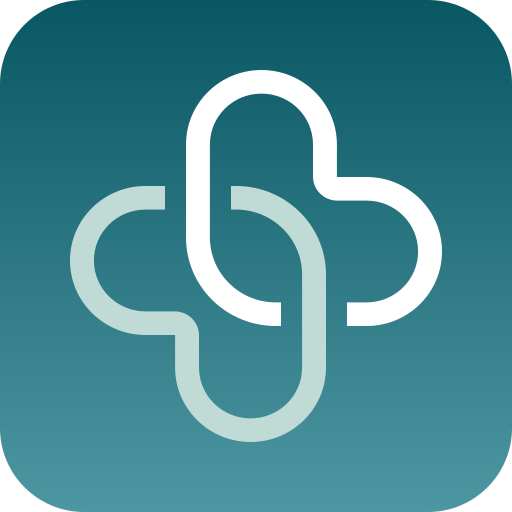

  

# App zum Doc

[App zum Doc](https://app-zum-doc.de/) is end-to-end encrypted booking and a full patient portal. Appointments, prescriptions, referrals, imaging results and inpatient pre-admission forms travel over a structured, encrypted channel between the practice and the patient. iOS, Android and modern browsers — no extra hardware, PVS-independent, hosted in Germany.

## F-Droid

The repository is public. Android CI builds a signed APK. Pushing `android@x.y.z` publishes that APK as a GitHub release for F-Droid. If **Build Android** is still running for the tagged commit, publish waits for it. If nothing is running for that commit, it uses the last successful Android build of the version in `apps/mobile/build-metadata.json`.

1. Tag with `scripts/mobile-sync.sh tag android --push` (creates `android@x.y.z`).
2. [Publish F-Droid](https://github.com/helpwave/app-zum-doc/actions/workflows/app-zum-doc-mobile-android-publish-fdroid.yaml) waits for a successful [Build Android](https://github.com/helpwave/app-zum-doc/actions/workflows/app-zum-doc-mobile-android-build.yaml) on that commit, checks the tag against `apps/mobile/build-metadata.json`, downloads the APK, checks `versionName` is `x.y.z`, and opens the release.

Listing copy and graphics live in `apps/mobile/fastlane/metadata/android/` (`en-US`, `de-DE`) and are linked from `fastlane/metadata/android` at the repository root so F-Droid can harvest them. Inclusion metadata is `metadata/de.helpwave.appzumdoc.yml`.

## Product

- **Patients** get a key pair on the device. The private key never leaves the phone. Book and shift appointments, request prescriptions, referrals and imaging, fill pre-admission questionnaires at home. No profiling. The app does not read message contents.
- **Practices** own the practice key pair. Every request arrives as one structured entry. PVS-independent, no extra hardware.
- **Privacy** is enforced by cryptography: no master key, no backdoor. Ciphertext is hosted in a certified German data centre.

End-to-end encryption uses the Signal Protocol via [libsignal](https://github.com/signalapp/libsignal). Sessions, keys and message payloads are sealed on the device with that protocol; the host stores ciphertext and cannot read it.

More: [app-zum-doc.de](https://app-zum-doc.de/).

## License

The mobile app is licensed under the [GNU Affero General Public License v3.0](apps/mobile/LICENSE).

## Versioning

Change the app version only in `apps/mobile/build-metadata.json` via `scripts/mobile-sync.sh`. Tags are `ios@x.y.z` and `android@x.y.z`. The binary version name is `x.y.z`. See [apps/mobile/README.md](apps/mobile/README.md).
