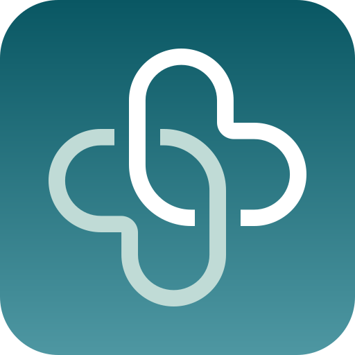

  

# App zum Doc

[App zum Doc](https://app-zum-doc.de/) is end-to-end encrypted booking and a full patient portal. Appointments, prescriptions, referrals, imaging results and inpatient pre-admission forms travel over a structured, encrypted channel between the practice and the patient. iOS, Android and modern browsers — no extra hardware, PVS-independent, hosted in Germany.

## F-Droid

F-Droid builds the app from source and ships it with our signature ([reproducible builds](https://f-droid.org/docs/Reproducible_Builds/)). `metadata/de.helpwave.appzumdoc.yml` is the recipe in fdroiddata.

1. Tag with `scripts/mobile-sync.sh tag android --push` (creates `android@x.y.z`).
2. [Publish F-Droid](https://github.com/helpwave/app-zum-doc/actions/workflows/app-zum-doc-mobile-android-publish-fdroid.yaml) builds the recipe twice in F-Droid's buildserver image (`scripts/fdroid-build.sh`) with a different IP, hostname, timezone and CPU count, fails if the two APKs differ, signs the APK with the release key, checks it with `apksigcopier`, and attaches `app-zum-doc-x.y.z.apk` to the GitHub release.
3. F-Droid's checkupdates picks up the tag, rebuilds the same commit, compares against that APK (`Binaries`) and publishes it with our signature (`AllowedAPKSigningKeys`).

Version bumps need nothing in fdroiddata. Any other change to the recipe's build steps must also be sent to fdroiddata, otherwise F-Droid's build no longer matches our APK.

Pushes to `main` and pull requests that touch the app, its dependencies, the recipe or the scripts run the same two builds, so anything F-Droid could not reproduce fails before a release. Locally: `docker run --rm -v "$PWD:/repo" registry.gitlab.com/fdroid/fdroidserver:buildserver-trixie /repo/scripts/fdroid-build.sh "$(git rev-parse HEAD)" /repo/fdroid-out`.

Listing copy and graphics live in `apps/mobile/fastlane/metadata/android/` (`en-US`, `de-DE`) and are linked from `fastlane/metadata/android` at the repository root so F-Droid can harvest them. Inclusion metadata is `metadata/de.helpwave.appzumdoc.yml`.

## Obtainium

[Add App zum Doc to Obtainium](https://apps.obtainium.imranr.dev/redirect?r=obtainium://app/%7B%22id%22%3A%22de.helpwave.appzumdoc%22%2C%22url%22%3A%22https%3A%2F%2Fgithub.com%2Fhelpwave%2Fapp-zum-doc%22%2C%22author%22%3A%22helpwave%22%2C%22name%22%3A%22App%20zum%20Doc%22%7D), or add `https://github.com/helpwave/app-zum-doc` by hand. Obtainium installs the APK attached to each `android@x.y.z` GitHub release. It is the same signed file F-Droid ships, so you can switch between the two without reinstalling.

Signing certificate SHA-256: `b0974e053c12fc9b20aa6f9f5c278c288b585494958b6b872787c5dee6f5973e`

## Product

- **Patients** get a key pair on the device. The private key never leaves the phone. Book and shift appointments, request prescriptions, referrals and imaging, fill pre-admission questionnaires at home. No profiling. The app does not read message contents.
- **Practices** own the practice key pair. Every request arrives as one structured entry. PVS-independent, no extra hardware.
- **Privacy** is enforced by cryptography: no master key, no backdoor. Ciphertext is hosted in a certified German data centre.

End-to-end encryption uses the Signal Protocol via [libsignal](https://github.com/signalapp/libsignal). Sessions, keys and message payloads are sealed on the device with that protocol; the host stores ciphertext and cannot read it.

More: [app-zum-doc.de](https://app-zum-doc.de/).

## License

The mobile app is licensed under the [GNU Affero General Public License v3.0](apps/mobile/LICENSE).

## Versioning

Change the app version only in `apps/mobile/build-metadata.json` via `scripts/mobile-sync.sh`. Tags are `ios@x.y.z` and `android@x.y.z`. The binary version name is `x.y.z`. See [apps/mobile/README.md](apps/mobile/README.md).
